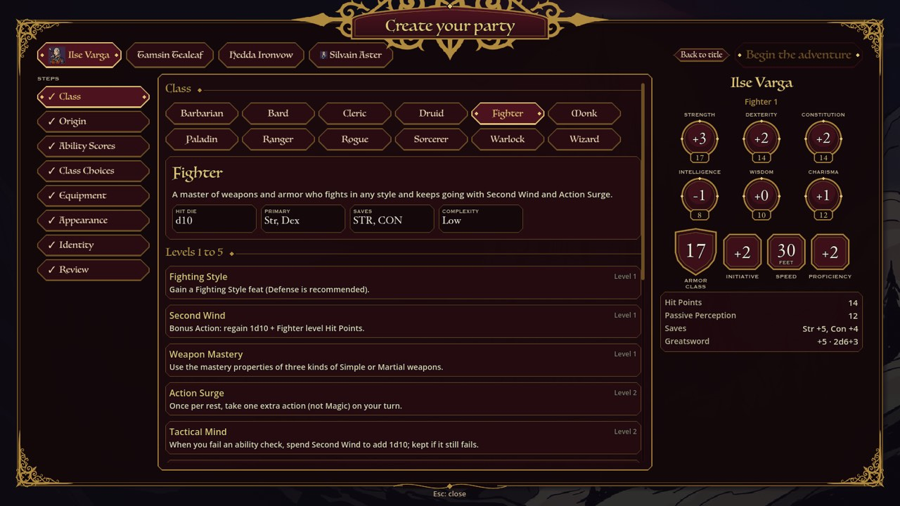
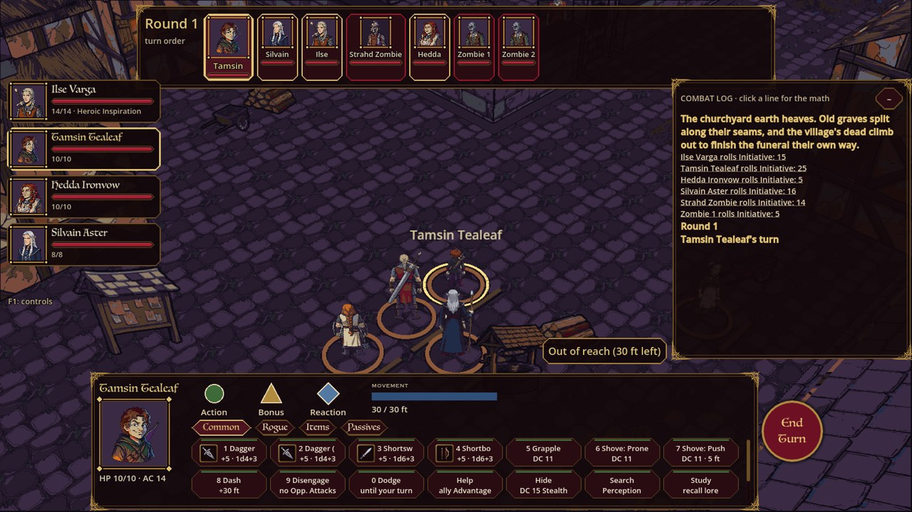
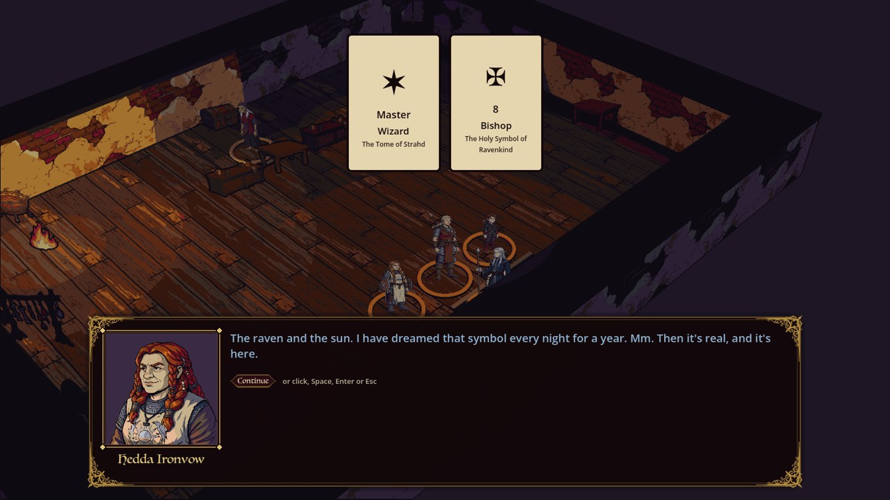
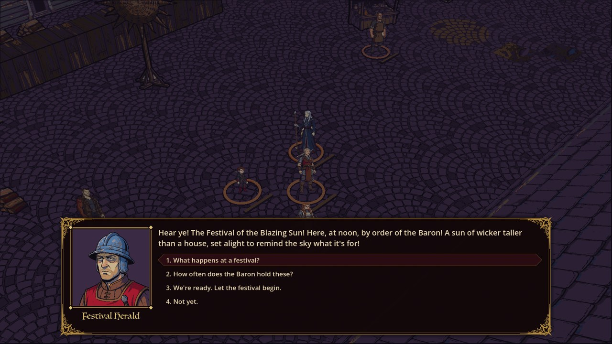
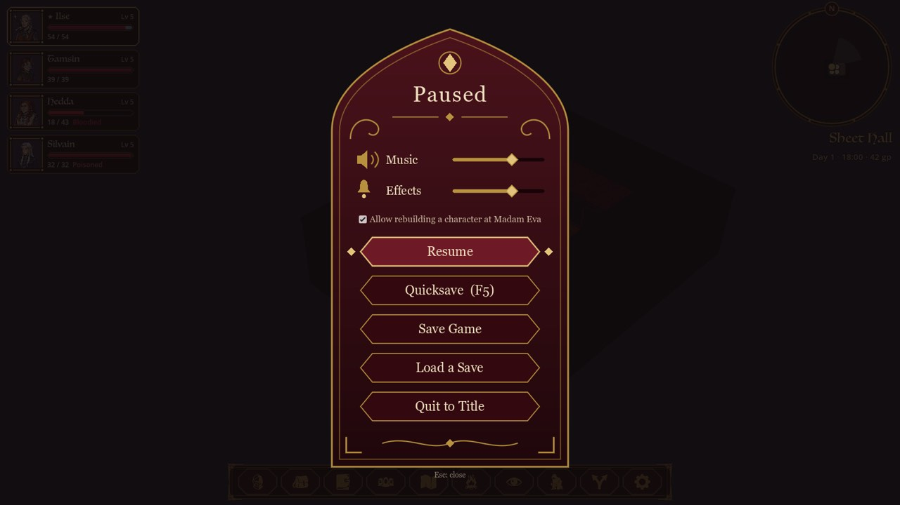

# Curse of Strahd


A single-player tactical RPG that plays the *Curse of Strahd* campaign on the 2024 Dungeons & Dragons rules. You
lead a party of four through the valley of Barovia: walk its villages, roads and haunted houses in an isometric view,
talk your way through conversations that roll real skill checks, and fight turn-based battles on a 5-foot grid
wherever trouble finds you. The rules engine follows the 2024 Player's Handbook closely, and every number on screen
can show where it came from.

It's built in Godot 4 with typed GDScript, for personal use only. It isn't distributed, and it's an unofficial fan
project: *Curse of Strahd* and *Dungeons & Dragons* belong to Wizards of the Coast.

The whole campaign is playable, from the road where the story begins to Castle Ravenloft, where it ends: Strahd's
castle in five parts, his parley and final battle in the room the Tarokka names, and five endings.

## Screenshots

| | |
|---|---|
|  |  |
| Pick the four pregenerated heroes, edit them, or build all four from scratch. | Character creation walks each hero through class, origin, scores and gear, with a live sheet beside it. |
|  |  |
| The Village of Barovia. Right-click anyone or anything for what you can do with it. | Vallaki's main street, with the Narrator setting the scene. |
|  |  |
| The road past the Tser Pool camp, with signs for each way out. | The Death House, the campaign's opening dungeon. |
|  |  |
| Fights start on the map you're exploring: turn order, party, hotbar and a log of every roll. | Area spells show who they'll catch, each target's chance to fail the save, and any ally in the blast. |
|  |  |
| Hover an enemy to see the odds and the damage before you swing. | The character sheet. Hover any number to see how it was worked out. |
|  |  |
| Madam Eva's Tarokka reading decides where the treasures, the ally and Strahd will be. | Conversations with portraits, voiced lines and skill checks that show who rolls and their chance. |
|  |  |
| The travel map: hours on the road, the arrival time, and a warning when you'd travel after dark. | The pause menu: volume, quicksave, save slots and loading. |

## Running the game

You need:

- macOS on Apple Silicon.
- Godot 4.7.2 at `/Applications/Godot.app`. Elsewhere, point `GODOT` at the binary (`make run GODOT=/path/to/Godot`).
- Python 3 for the data checks in `make ci` (standard library only).
- Blender 5.2, a `GEMINI_API_KEY` and an `ELEVENLABS_API_KEY` only if you rebuild art or voices. Playing needs none
  of them, since the art and the voice clips are in the repo.

Start the game from the repo root:

```bash
make run
```

The first run imports every asset, which takes a while. After that `make run` only re-imports when files have
changed since the last import, so a merge that adds scripts or images doesn't stop the game at a parse error.

Before merging anything into `main`, run the local CI:

```bash
make ci
```

It runs `validate` (every data file against its schema, and every feature marked as built really read by the code), `lint` (the pure
`rules/` and `combat/` libraries compiled on their own) and `test` (the unit and integration suites in a headless
Godot). All three must pass with a clean log.

### Make targets

| Command | What it does |
|---|---|
| `make run` | Starts the game at the title screen. |
| `make arena` | Opens the combat test arena: four level 3 pregens against wolves and zombies. |
| `make ci` | `validate`, `lint` and `test` together. |
| `make test [ONLY=substr]` | Imports, then runs the test suites, or only the tests whose names contain `substr`. |
| `make validate` | Checks every data file against its schema, and that features marked as built are read by the code. |
| `make lint` | Compiles `rules/` and `combat/` standalone, so a stray autoload reference fails. |
| `make import` | Re-imports assets headlessly. Run it after adding a `class_name`. |
| `make capture SCENE=… NAME=…` | Opens a window for a few seconds and saves screenshots to `captures/`. Options: `LOCATION=<id>` starts the story there, `ENCOUNTER=<id>` starts a fight, `DIALOGUE=<file:node> [BEATS=n]` plays a conversation, `MAP=1` opens the travel map, `SHOP=<npc>` opens a shop, `LOAD=<slot>` starts from a save, `FOCUS=<node>` takes close-ups of one node as it walks. |
| `make palette` | Rebuilds the colour palettes after editing their lists. |
| `make voice [SPEAKER="…"] [LIMIT=n] [DRY=1] [MAX_USD=n]` | Generates the missing spoken lines with the pinned ElevenLabs voices. |
| `make sprite TURNAROUND=<png> ID=<id>` | Turns a character turnaround sheet into an 8-direction walking sprite. |
| `make sprites [ONLY="id …"]` | Re-renders every walk sheet from its turnaround with its recorded settings. |
| `make anims [ONLY="id …"] [GENERATE=1]` | Builds walk and attack sheets; `GENERATE=1` first draws any missing keyframes. |
| `make portrait SRC=<png> ID=<id>` | Crops, sizes and palette-matches a portrait. |
| `make textures [GENERATE=1] [ONLY=…]` | Builds the environment texture sets. |
| `make prop SRC=<png> ID=<id> HEIGHT=<units>` | Cuts out a single billboard prop. |
| `make props [GENERATE=1] [ONLY=…]` | Builds the set dressing sheets: props, wall pieces and doors. |
| `make ui_art` | Builds the menu ornaments and menu icons. |
| `make icons` | Frames the spell and item icons from the game-icons.net silhouettes. |
| `make standin` | Renders a stand-in villager so the sprite pipeline runs without generated art. |
| `make wireframes` | Redraws the UI flow wireframes in `docs/ui/wireframes/`. |

The screenshots in this README came from `make capture` with the scenes in `tools/capture/` and
`scenes/main_menu.tscn`, then shrunk to 1280 px JPEGs.

## Controls

In a fight, press **F1** (or Start on a controller) for the full list of combat controls.

**Exploring**

| Input | Action |
|---|---|
| Left-click | Walk there, or walk up to a person or thing and use it |
| Right-click | Everything you can do with that person, thing or party member |
| WASD or arrows | Step the party leader |
| Q / E, mouse wheel | Turn the camera, zoom |
| Tab, 1 to 4 | Next party leader, or pick one |
| C · I · J · P | Character sheet · Inventory · Journal · Party |
| M · R | Travel map · Rest |
| F · V · G | Search · Sneak · Split the party |
| F5 · F9 | Quicksave · Quickload |
| Esc | Close the open panel, or open the pause menu |

On a controller: the left stick walks, A uses the nearest thing, X searches, Y opens the journal, LB the sheet, RB the
inventory, Back the menu for whatever is beside you, and Start pauses.

**Fighting**

| Input | Action |
|---|---|
| Hover the floor, click | See the path and its cost, then move |
| Hover an enemy, click | See the odds, then attack with the best weapon in reach |
| 1 to 0, Z / X | Use a hotbar slot, change hotbar tab |
| [ and ] | Change the spell slot level |
| Enter · Esc · Space | Confirm · Cancel · End the turn |
| T · Tab · L | Next target · Inspect the next party member · Show or hide the log |
| WASD, Q / E, wheel | Pan, turn and zoom the camera |

On a controller, hold LB for a radial menu of actions. Reactions ask first unless you set a rule for them.

## Features

**The 2024 rules**

- A rules engine that keeps to the 2024 Player's Handbook, with each rule's status tracked in
  [docs/rules/coverage.md](docs/rules/coverage.md) and every departure explained in
  [docs/rules/deviations.md](docs/rules/deviations.md).
- 12 classes and 54 subclasses, 14 species, 16 backgrounds, 86 feats and 390 spells, including the
  *Ravenloft: The Horrors Within* options (the Dhampir, Hexblood, Lupin and Reborn) and Dark Gifts, among them the
  Amber Temple's vestiges.
- Every die goes through one roller, and every number the UI shows carries its breakdown.
- The party levels at story milestones, up to level 11 for the content built so far.

**Your party**

- Four pregenerated heroes (a fighter, a rogue, a cleric and a wizard), or a step-by-step creator for your own four,
  with recommendations at each step and a check on what the party is missing.
- You control every party member and every guest who joins you, such as Ireena and Ismark. The AI only runs enemies
  and bystanders.
- A full character sheet, inventory with attunement, spell preparation, short and long rests, and a level-up screen.

**Barovia**

- 69 locations across 18 regions, from the Death House and the Village of Barovia to Vallaki, Krezk, the Wizard of
  Wines, Argynvostholt, Van Richten's Tower and the Amber Temple.
- A 3D board with 8-direction sprites, day and night lighting, a minimap, and signs on every exit.
- Doors, locks, traps, containers and hidden things to search for; sneaking, splitting the party, and banter between
  party members.
- A travel map with road times, a clock, and random encounters on the roads that get worse after dark.
- 40 quests in the journal, shops that buy and sell, books collected into a codex, and 104 people to meet.

**Conversations**

- Branching dialogue with portraits and skill checks that show who will roll and their chance before you choose.
- Madam Eva's Tarokka reading, drawn once per playthrough, moves the Tome, the Holy Symbol, the Sunsword, the ally and
  Strahd's final room.
- 5,232 voiced lines across the cast and the Narrator, generated with ElevenLabs.

**Combat**

- Turn-based fights on a 5-foot grid that start where you are, with Initiative, a turn order strip, and surprise
  on either side (sneak up on enemies, or be ambushed).
- Action, Bonus Action, Reaction and movement shown at a glance; a hotbar of weapons, spells, items and class
  features.
- Hit odds before you attack, area templates that warn about friendly fire, and a combat log where you can click any
  line to see its math.
- Weapon Mastery, Heroic Inspiration, Concentration, opportunity attacks, reactions with your own rules, and death
  saves.
- 113 monsters, and 475 magic items from the 2024 Dungeon Master's Guide, from potions to the Deck of Many Things.
- A save at the start of every round, so loading puts you back into the fight.

## Project layout

| Folder | What's in it |
|---|---|
| `rules/` | The rules engine: a pure library with no nodes, scenes or UI. |
| `combat/` | Grid, encounters, spells, features, AI and the action catalog, also pure logic. |
| `story/` | Story state, dialogue runner, quests, travel, the Tarokka and treasure. |
| `world/`, `ui/`, `scenes/` | What you see: the board, the HUDs and screens, and the thin scene roots. |
| `core/` | Autoloads: dice, game state, saving, input, audio and voice. |
| `data/` | Classes, spells, monsters, items, locations, NPCs, quests and more, as JSON with schemas. |
| `narrative/` | The conversations, one `.dialogue` file per scene. |
| `art/`, `audio/`, `blender/` | Art, voices and the pipelines that build them. |
| `tests/` | Unit and integration tests. |
| `tools/` | Data checks, captures, and the art and audio scripts. |
| `docs/` | Decisions in `adr/`, interface contracts in `contracts/`, rules coverage, region notes, UI and art guides. |

## Credits

The full list, with links and licence files, is in [docs/assets/LICENSES.md](docs/assets/LICENSES.md), and the game
shows it under Credits on the title screen.

**Rules.** This work includes material from the System Reference Document 5.2.1 ("SRD 5.2.1") by Wizards of the Coast
LLC, available at https://www.dndbeyond.com/srd. The SRD 5.2.1 is licensed under the Creative Commons Attribution 4.0
International License, available at https://creativecommons.org/licenses/by/4.0/legalcode. Content beyond the SRD is
used for personal play only; the data files hold mechanics and our own descriptions, not the books' text.

**Icons.** Spell and item icons by Lorc, Delapouite, Skoll, Sbed, Caro Asercion, Willdabeast, Cathelineau,
DarkZaitzev, Carl Olsen, Zajkonur and Faithtoken from [game-icons.net](https://game-icons.net/), under
[CC BY 3.0](https://creativecommons.org/licenses/by/3.0/), and by Zeromancer (CC0). They were framed and coloured for
this game.

**Music.**

- Kevin MacLeod ([incompetech.com](https://incompetech.com/)): "Ossuary 6 - Air", "Oppressive Gloom", "Folk Round",
  "Duet Musette", "Darkling", "Darkest Child" and "Unholy Knight", under
  [CC BY 4.0](https://creativecommons.org/licenses/by/4.0/).
- Toccata and Fugue in D minor, BWV 565 (J. S. Bach), played by Norbert Schenk, CC BY 4.0, via Wikimedia Commons.
- "Fanfares" (victory and defeat) by Spring Spring, CC BY 4.0, via OpenGameArt.org.
- Csárdás (Vittorio Monti), played by the United States Air Force Band, public domain, via Wikimedia Commons.

**Sound effects.** Kenney's RPG Audio, Impact Sounds and Interface Sounds (CC0). From OpenGameArt.org, all CC0:
80 CC0 RPG SFX by rubberduck, sword sounds by StarNinjas, swishes by artisticdude, Magic Spell SFX by JaggedStone,
fire-1 by AntumDeluge and crow caw by zeroisnotnull. From Wikimedia Commons: howling wind by Tvabutzku1234 (CC0),
wolf howls by the US Fish and Wildlife Service and rain and thunder by ezwa (both public domain).

**Art and voices.** Characters, portraits, textures, props, menu art and the title art were drawn for this game with
Google Gemini and finished in Blender. The spoken lines were generated with ElevenLabs. The menus use fonts that ship
with macOS.
