# Character creation (core flow 1 of 4)

Status: **approved by the owner 2026-10-06 ("Looks good")** · Owner role: Character and Party UX · Plan §5.1, §5.6
Engine: `CharacterBuilder` (rules/progression/character_builder.gd), `ChoiceOptions`, `PartyCoverage`.
Built in Phase 3 for the four Phase 1 classes; Phase 4 adds the other eight classes as data, with no UI change.

## What this screen must do

- Get a player from "new game" to a party of four in a few minutes (pregenerated party), or let them build all
  four in full depth.
- Show every rule decision the 2024 rules offer, explain every number, and never let an illegal character
  through, while never blocking a legal but weak one.
- Work the same on mouse and keyboard and on a controller; text scales; nothing is shown by color alone.

The UI never computes rules. Every list, number, reason and warning on these screens comes from
`CharacterBuilder`; the UI only lays them out and sends picks back.

## Frame (every step)

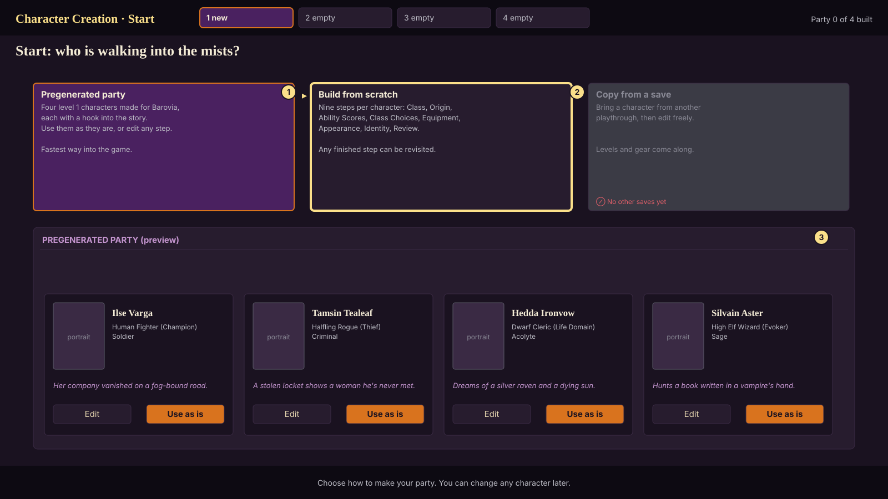

- **Header**: screen name, the party strip (four slots; ✓ built, ▸ editing; LT/RT or Ctrl+Tab switches slot,
  each slot keeps its own progress), and a progress crumb ("Ilse · step 3 of 9").
- **Steps rail** (left, from step 2): ✓ done, ! blocking problem, ~ warning only, · not started. Any step can be
  opened at any time; changing an earlier step re-checks the later ones and marks them.
- **Live sheet** (right): the character as it stands (`builder.preview()`): scores and modifiers, AC, Hit Points,
  Speed, Initiative, Proficiency Bonus, saves, main attack, passive Perception, and for casters spell DC, slots
  and the spell counts. Values the current step changed get a frame and ▲/▼ (shape, not only color).
- **Footer**: Back, a hint line for the step, Next (Confirm on Review).

## Steps

### 1. Start (`cc_01_start`)
Changed by the owner (2026-10-06): "Only 1 character of the party can be the custom created one (the player can choose
which one they want to replace). Using a custom character at all is optional." Changed again on 2026-10-07: six new
companions replace the four Phase 1 pregens, and the player picks who travels.

The start screen ("Who goes into the mists?") shows the roster, the pregens marked `roster: true` in data/pregens
(`Pregens.roster_ids()`, in name order): Godrick Pendlebrook (Goliath Paladin), Kip Smudgewick (Tiefling Warlock),
Liriel Dawnsong (High Elf Cleric), Ratatoille (High Elf Wizard), Thistle (Human Ranger) and Wren Featherfoot
(Halfling Monk). Each card has the portrait, name and class line, with the summary and hook in its tooltip. The
player lights up to four (`StoryState.PARTY_CAP`) to travel; the first four are lit to begin with. The rest start
at camp and can be swapped in on the road (party_management.md, "Who travels"). A seventh card, **Your own hero**,
opens the creator in **hero mode**; the hero joins the roster and is lit to travel, taking the last lit slot if four
are already lit. **Begin with these 4** starts the game at level 1. The companions keep their builds and their
personal quests (docs/story/personal_quests.md). Editing the pregens and building a whole party from scratch are gone.

The old four (Ilse, Tamsin, Hedda and Silvain) stay in data/pregens with `roster: false`, for older saves, the
combat arena and tests.

Hero mode is the same steps for one character, with three differences: the party strip shows the companions picked
to travel ("Travelling with Godrick, Liriel and Thistle"); the **Appearance** step is the paper doll below; and
Review's party composition counts the companions. A hero can't take any pregen's name, the old four's included
(`CharacterBuilder.name_problems`). Madam Eva's respec of a custom hero opens the same Appearance step.

### 2. Class (`cc_02_class`)
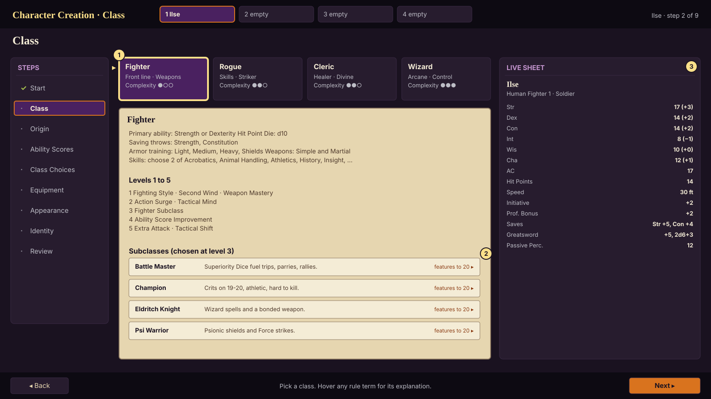

Class cards with role tags and a complexity rating (`available_classes()`). The detail panel
(`class_preview(id)`) shows primary ability, Hit Die, saves, training, the skill list, features for levels 1-5
and every subclass with a one-line summary; "features to 20" opens the subclass browser read-only. Picking a
class sets the recommended Standard Array if the player hasn't touched scores yet.

### 3. Origin (`cc_03_origin`)
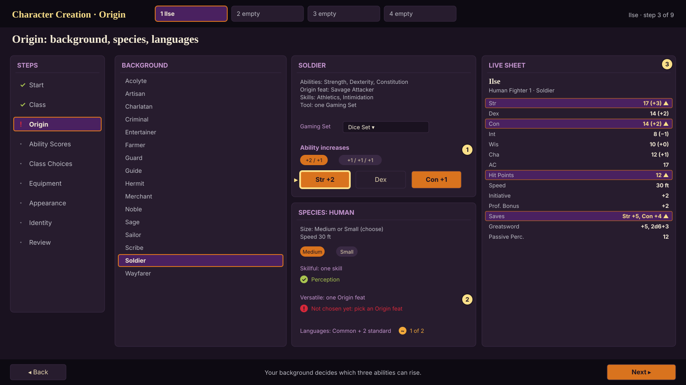

- **Background** list with details: its three abilities, origin feat, two skills, tool (a dropdown when it is "one
  Gaming Set" and so on), equipment summary.
- **Ability increases**: a +2/+1 or +1/+1/+1 toggle, then buttons on the background's three abilities. This is
  the `background.abilities` choice (3 picks, at most 2 on one ability, cap 20).
- **Species** list with its sub-choices as the data asks: size (`species.size`), lineage, spellcasting ability for
  species spells, Keen Senses, Skillful, Versatile (Origin feat, whose own choices then appear inline).
- **Languages**: Common plus two standard languages (`origin.languages`).

### 4. Ability scores (`cc_04_abilities`)
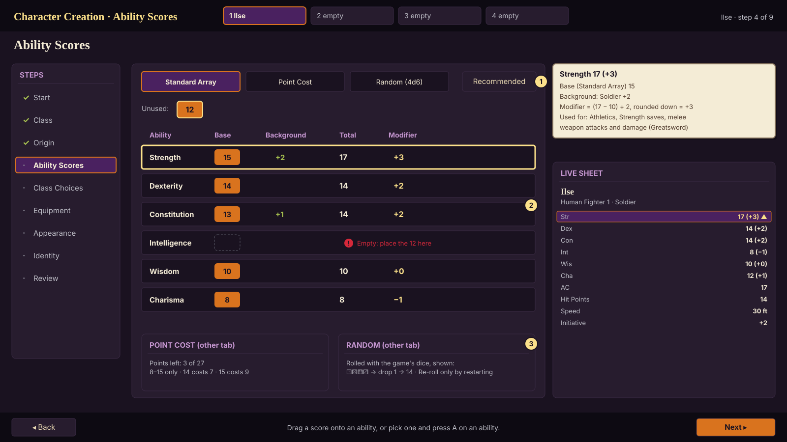

Tabs for the three 2024 methods: **Standard Array** (drag a score onto an ability, or select a score and press A /
Enter on an ability), **Point Cost** (27 points, 8 to 15, costs shown, points-left counter:
`point_buy_remaining()`), **Random** (`roll_scores(dice)`: 4d6 drop lowest six times with the game's seeded dice,
each roll shown with the dropped die; no re-rolls except by restarting the character). **Recommended**
(`apply_recommended_scores()`) fills the class's suggested spread from the current numbers. Each row shows base,
background bonus, total and modifier; focusing a row opens its breakdown.

### 5. Class choices (`cc_05_class_choices`, `cc_05b_spells`)
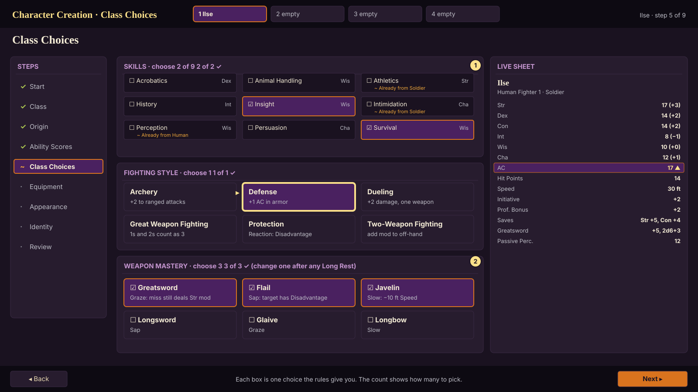
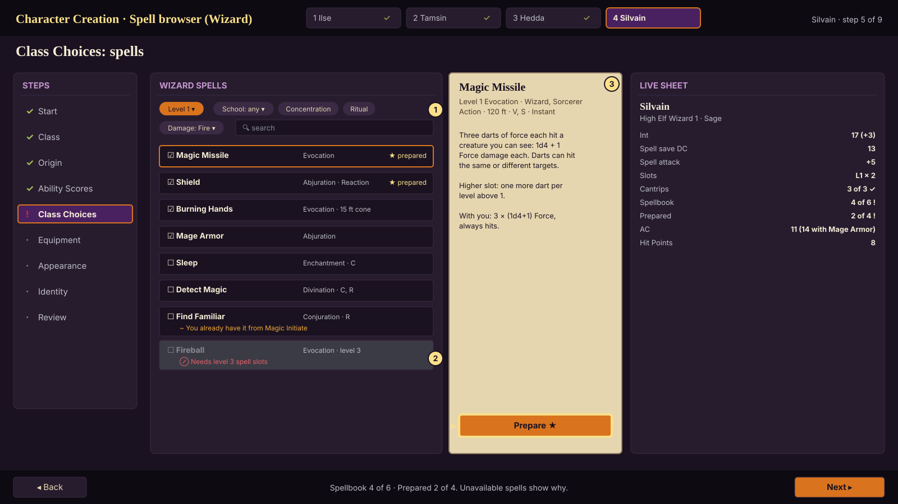

One box per choice from `choices_for_step(CHOICES)`, titled with the count ("Skills · choose 2 of 9 · 2 of 2 ✓").
The widget is picked by the choice's `kind`, so new content never needs new UI:

| kind | Widget |
|---|---|
| skill, expertise, tool, language | checklist grid with the governing ability |
| fighting_style, feat, option, maneuver, subclass | cards with summary; full text on focus |
| weapon_mastery | weapon rows with the mastery property and what it does |
| cantrip, spell, spellbook | the spell browser |
| ability_increase | ability buttons with current → new score |
| size, lineage, spellcasting_ability, damage_type | segmented buttons |

The **spell browser** filters by level, school, Concentration, Ritual and damage type, with search. Each row
shows school and tags; the card shows the full rule text plus what it does *for this character* ("3 × (1d4+1)
Force", from `Character.spell_preview`). Prepared casters (Cleric) prepare from the whole list; the Wizard picks six
spells for the spellbook and then prepares four of them. Spells too high for the character stay listed with
"Needs level 3 spell slots".

### 6. Equipment (`cc_06_equipment`)
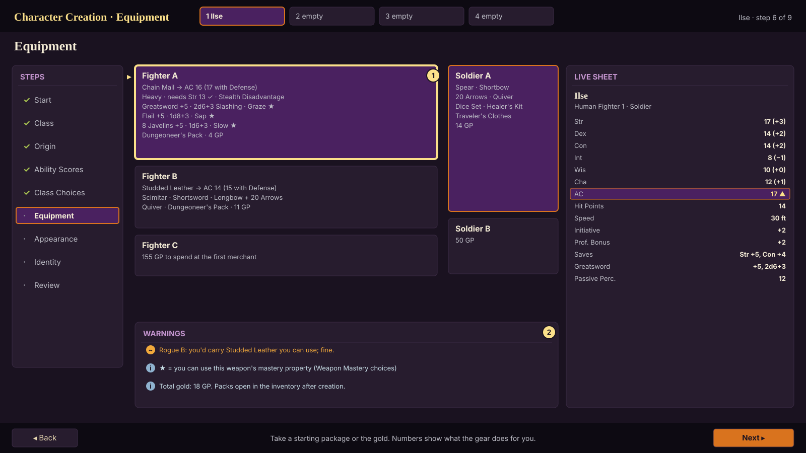

The class and background options (A/B/C) as cards. Weapons show attack and damage *for this character* and a ★
when their mastery is usable; armor shows the AC it gives, the Strength requirement and Stealth Disadvantage.
Gear the character can't use well is flagged as a warning, never blocked.

### 7. Appearance (`cc_07_appearance`)
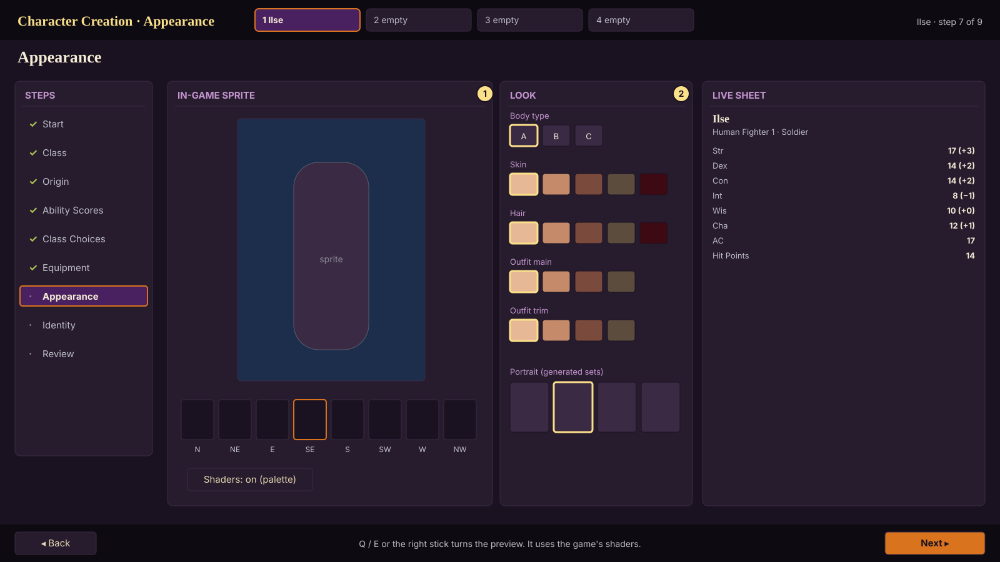

For the custom hero (`AppearancePanel`, docs/art/creator.md), four tabs beside a live sprite in a gothic arch that
slowly turns through the 8 directions, with Stand, Walk and Attack buttons and turn arrows:

- **Body:** Woman or Man, Slender, Average or Broad, Short, Average or Tall (shown by how the figure stands in the
  arch), and nine skin tones as arched swatches of their shades.
- **Head:** seven heads (plain, sharp, round, weathered, elfin, horned, tusked), eight hairstyles and bald, eight
  hair colours, six beards and clean-shaven. Heads, hairstyles and beards show as small pictures of this hero's own
  head with that pick.
- **Outfit:** six starting outfits, each with what it looks like and which classes it suits; a class pick chooses
  the one that suits it until the player picks one themselves. The outfit is the look (and the weapon in the attack
  art); gear on the sheet still comes from class and background.
- **Portrait & voice:** ten portraits, and a woman's or a man's voice (`hero_female`, `hero_male`) with a sample.

The pregens keep their own looks (the four portrait cards).

### 8. Identity (`cc_08_identity`)
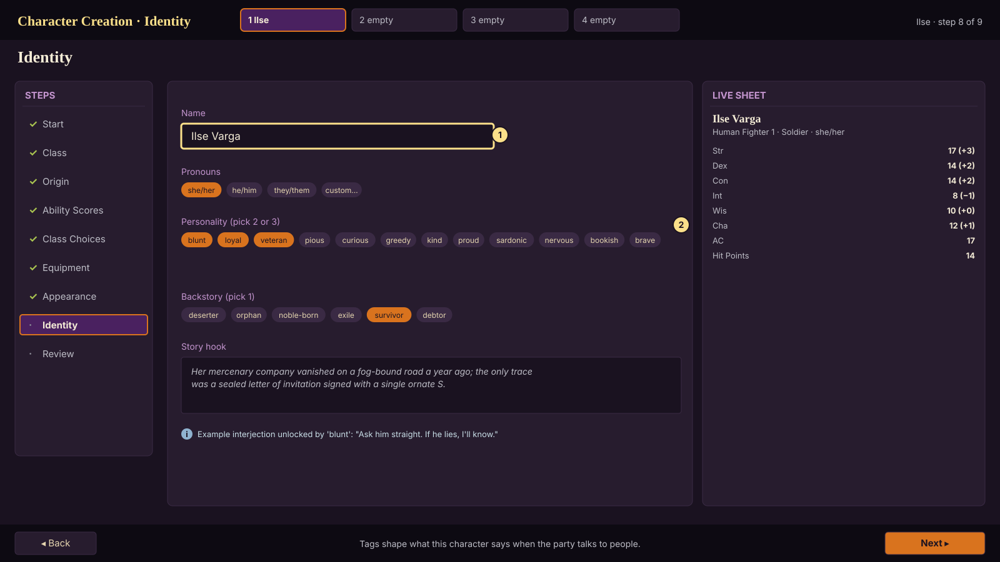

Name, pronouns (preset or custom), two or three personality tags and one backstory tag (stored in
`build.identity`; the narrative system reads them for party interjections), and the story hook. An example
interjection shows what a tag unlocks.

### 9. Review (`cc_09_review`)
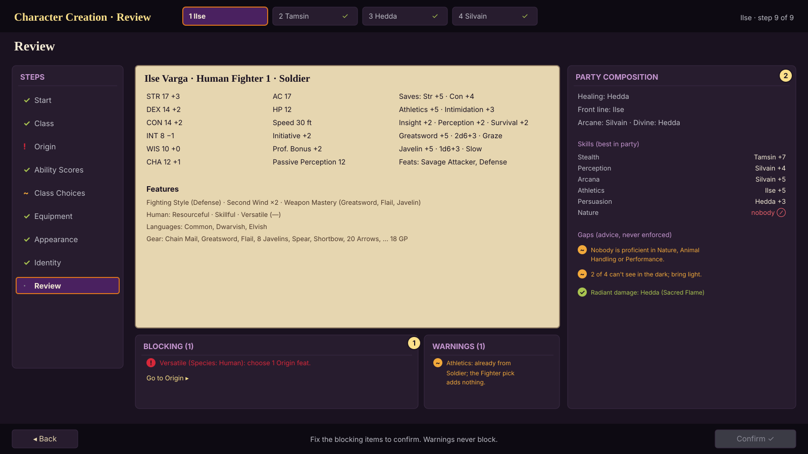

The full sheet, then **Blocking** (from `errors()`, each with a "Go to step" link) and **Warnings** (from
`warnings()`) in separate lists. Confirm is disabled while anything blocks. **Party composition**
(`PartyCoverage.analyze`) opens beside it: who heals, who holds the front line, arcane and divine casters, the best
character for each of the 18 skills, damage types, darkvision and light sources, and gaps in plain words. Gaps are
advice, never enforced.

## Explanations, input and accessibility (`cc_10_explanations_and_controller`)
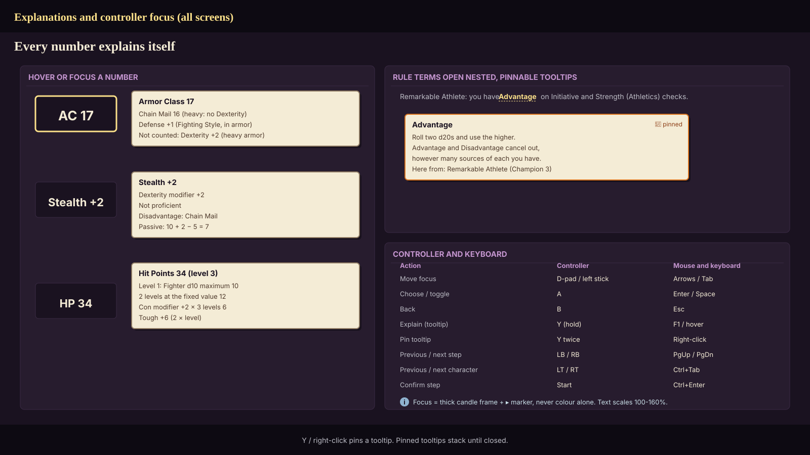

- Every number opens its breakdown on hover or focus: the engine's `Breakdown.describe()` parts, e.g. "AC 17 =
  Chain Mail 16 + Defense 1", with things that don't count named ("Dexterity: heavy armor").
- Rule terms (Advantage, Concentration, Weapon Mastery, Heroic Inspiration, Bloodied ...) are links that open
  nested tooltips; Y twice or right-click pins one; pinned tooltips stack until closed.
- Unavailable options stay visible with the reason from `ChoiceOption.reason`; soft warnings show
  `ChoiceOption.warning` with a ~ icon.
- Controller and keyboard map as in the wireframe. Focus is a thick candle frame plus a ▸ marker. Text scales
  100-160%. The UI draws on a CanvasLayer after the palette pass, so state colors are never quantized away.

## States

| State | What the player sees |
|---|---|
| Empty slot | "new" in the party strip; Start step |
| Step not started | · in the rail; Next still works (skipping ahead is allowed) |
| Step incomplete | ! in the rail, the missing count on the box ("1 of 2"), listed on Review |
| Illegal pick (e.g. after changing class) | red frame + ! on the box and the reason; Review blocks |
| Warning | ~ icon and text; never blocks |
| Complete | ✓ in the rail; Confirm enabled on Review |
| Controller focus | candle frame + ▸; LB/RB step, LT/RT character, Y explain |
| Leaving with unsaved edits | "Discard changes to Ilse?" with Keep editing as the default |
| Changing an earlier step | dependent picks that no longer exist are dropped and the affected steps show ! |

## Engine contract (implemented in Phase 1)

`CharacterBuilder.new(compendium, existing_build)` ·
`available_classes() / class_preview(id) / set_class(id)` ·
`available_backgrounds() / set_background(id) / available_species() / set_species(id)` ·
`set_ability_method(m) / set_base_scores(d) / set_score(ab, v) / roll_scores(dice) / apply_recommended_scores() /
point_buy_remaining() / ability_problems()` ·
`all_choices() / pending_choices() / choices_for_step(step) / get_choice(key) / choose(key, picks) /
clear_choice(key)` ·
`equipment_options() / set_equipment(source, option)` · `set_name / set_identity / set_appearance` ·
`preview() -> Character / errors() / warnings() / step_status(step) / build_character()`.
Each `Choice` has `key, kind, count, label, source, picks, options[]`; each `ChoiceOption` has
`id, label, summary, legal, reason, warning, tags, data`.

## Acceptance

- Headless (Phase 1, passing): every class and subclass builds through `CharacterBuilder` and levels to 5 through
  `LevelUpController` with no dead ends; the pregenerated party matches hand-worked sheets (docs/rules/reference_party.md).
- Headless UI test (Phase 3): click through creation for each class with the keyboard map only, then the
  controller map only.
- Every number on the live sheet has a breakdown; every greyed option has a reason (a UI test walks them all).
- UX review at the milestone exit against plan §5.6.

## Questions for the owner

1. Random scores: one roll per character with no re-roll (current spec), or allow re-rolling?
2. Should "Copy from a save" exist in v1, or wait until there are saves worth copying?
