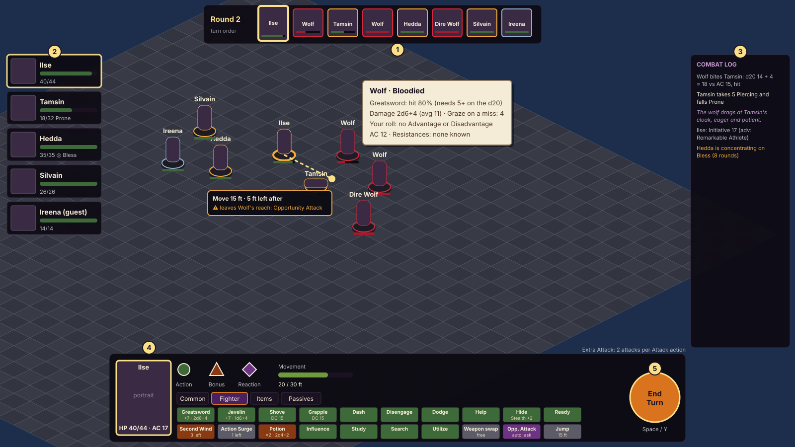
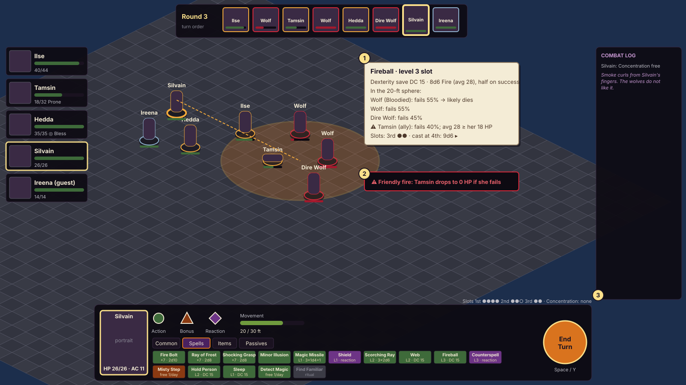
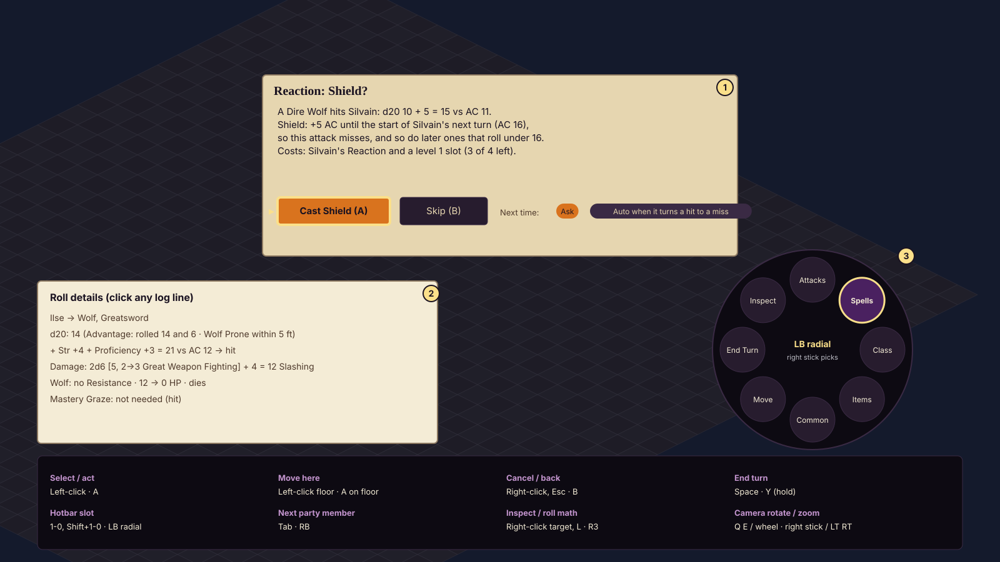

# Combat view and controls

Status: **approved by the owner 2026-10-06 ("Looks good")** (added at the owner's request) · Owner role: UI/UX ·
Plan §5.3 · Built in Phase 2 · Layout inspired by Baldur's Gate 3's turn-based combat screen (initiative strip on
top, party on the left, hotbar and End Turn at the bottom, log on the right), drawn in our palette and style.

## What this screen must do

- Make a 2024 turn readable at a glance: whose turn it is, what they have left (Action, Bonus Action, Reaction,
  movement), what each option will do, and the odds, before the player commits.
- Keep the player in charge of every party member and guest (plan pillar 2). The game never acts for them; it only
  asks (reaction prompts) or follows rules the player set ("auto when it turns a hit to a miss").
- Show the dice and the math for every roll (plan §5.3 "visible dice and math").

## Layout (`cb_01_combat_view`)

1. **Initiative strip** (top center): round number and portraits in turn order; the active creature is larger with a
   candle frame; enemies have red frames, the party gold, guests moonlight blue; a thin HP bar under each (enemies
   show Bloodied and dead states, not exact HP). Hover a portrait to highlight the creature on the field.
2. **Party frames** (left): the four party members and any guest, with HP bars, conditions as named chips (Prone,
   Poisoned, Bless ◎ for Concentration) and the level-up badge. Click or Tab to switch the controlled character on
   their turn or to inspect them otherwise.
3. **Combat log** (right): every roll as one readable line (`D20Test.describe()`, `DamageResult.describe()`),
   Narrator lines in italics (plan §5.7, rare and short in combat), warnings in amber. Click a line for the full
   math (see cb_03).
4. **Hotbar** (bottom): the active character's portrait with HP and AC; the action economy as shapes plus words
   (Action ●, Bonus Action ▲, Reaction ◆; greyed when spent) and a movement bar ("20 / 30 ft"); tabs (Common,
   class name or Spells, Items, Passives); slots colored by what they cost (Action green, Bonus Action ember,
   Reaction plum, free slate) and labelled with their numbers ("Greatsword +7 · 2d6+4", "Second Wind 3 left").
   Every PHB action is on Common: Attack, Dash, Disengage, Dodge, Help, Hide, Influence, Magic, Ready, Search,
   Study, Utilize, plus Grapple and Shove (Unarmed Strike options) and Jump. Extra Attack shows "2 attacks per
   Attack action".
5. **End Turn**: a large round button (Space, or hold Y). If the character still has their Action, the first press
   shows "End turn with your Action unused?". Leftover movement doesn't ask (owner feedback 2026-10-06).
   **Undo move** under it (Ctrl+Z) takes back the last move while nothing came of it (no dice, no reaction, nothing
   new seen), one move at a time back to the last thing that wasn't a move (`Encounter.undo_move`).

On the field: nothing is lit until the pointer asks (owner 2026-10-06: the always-on blue squares of where a creature
could move were noise). Hovering the floor shows the walk as a dotted trail to a ring where the creature would stop,
with feet used and left; the ring turns red and the tooltip warns before a step that provokes an Opportunity Attack
("leaves Wolf's reach"), naming the creature. A square out of reach shows only a pale ring and why. Hovering
a creature shows the **target tooltip**: hit chance and the d20 needed, damage with average, mastery effects (Graze
on a miss), Advantage/Disadvantage with their sources, cover, and what the party knows of its defenses.

## Targeting and areas (`cb_02_targeting`)

- Spells and area attacks preview their template on the grid (sphere, cone, cube, line, emanation) from the spell
  data, with every creature inside listed: save and DC, the chance each fails, expected damage, and whether it would
  likely drop.
- **Friendly fire** is called out in red with what happens to the ally; it never blocks (the player decides).
- **Walls are drawn** (Wall of Fire, Wind Wall, Wall of Stone, Ice and Force, Wall of Thorns, Blade Barrier, Prismatic
  Wall): click the square where the wall begins, then squares touching the last one (a click further along a
  straight line adds the squares between); the floor shows the squares drawn and the next one (a red ring and the
  reason when it can't go there), the tooltip the length used and who stands in the wall. Backspace or right-click
  takes back the last square; Enter or a click on the last square finishes. A Wall of Fire then shows the side that
  would burn under the pointer: click the side. A ring, globe or dome (right-click menu) is placed at a point.
- **Second picks** (world/combat/target_picker.gd): Commander's Strike's ally, then the creature it attacks (Enter: its
  best target); Crown of Madness's target, then the creature it must attack (Enter, or a click on the crowned creature:
  no one), and the same pick on the keep-control action; after a Maneuvering Attack hit, the ally that moves (skipped
  when only one can) and its square, with the path and any other enemy's Opportunity Attack shown. Backspace or
  right-click goes back a step; Esc cancels (and passes on the maneuver's move).
- Upcasting: the slot pips beside the tooltip pick the slot level and update the numbers (Fireball 8d6 → 9d6).
- Concentration: casting a second Concentration spell warns that the first one ends, naming it.

## Reactions, roll details and the controller (`cb_03_reactions_and_controls`)

1. **Reaction prompt**: the trigger in plain words with the numbers ("hits Silvain: 15 vs AC 11"), what the reaction
   would change ("AC 16, so this attack misses"), its cost, and Cast / Skip. "Next time" sets a per-character rule
   for that reaction: Ask (default), Never, or an automatic condition such as "auto when it turns a hit to a miss"
   (plan §5.3: a rule the player sets, not AI judgment). Opportunity Attacks, Shield, Counterspell, Uncanny Dodge,
   Parry and Riposte all use this prompt.
2. **Roll details**: any log line opens the whole calculation, with dice, Advantage sources, every modifier, damage
   dice before and after Great Weapon Fighting, Resistances, and mastery effects.
3. **Controller**: LB opens a radial menu (Attacks, Spells, Class, Items, Common, Move, End Turn, Inspect); the right
   stick picks, A confirms. The bottom panel lists the full mouse, keyboard and controller map.

## States

| State | What the player sees |
|---|---|
| Party member's turn | hotbar active; portrait enlarged in the strip; camera eases to them |
| Enemy or neutral turn | hotbar dimmed with "Wolf's turn"; the log narrates; reactions can still prompt |
| Out of an action type | its shape greyed; slots that need it greyed with the reason ("Bonus Action used") |
| Slot unavailable | greyed with why ("No level 3 slots left", "Needs a free hand", "Incapacitated") |
| Movement preview | dotted path to a ring, feet used and left, Opportunity Attack warnings (red ring), difficult terrain shown as doubled cost |
| Targeting | template on the grid, creatures listed with chances; Esc/B cancels |
| Reaction pending | modal prompt; the turn pauses; a timer is never used |
| Character at 0 HP | frame greyed; on their turn the hotbar shows the Death Saving Throw button and the tally |
| Combat start | an opening beat before the first turn (see below); surprise explained per creature |
| Combat end | the combat HUD fades out and the exploring HUD back in; survivors who aren't the party fade away |

## Into a fight and out again

Owner 2026-10-06: the switch into combat felt abrupt (the party's figures were swapped for fresh ones facing the
camera, foes popped in off screen, the HUD cut, the floor lit up). A fight now opens with a short beat
(`CombatView.INTRO_TIME`) while the rules are already running:

- The party and guests keep the figures they were exploring with (mid-step, facing, the lit lantern) and turn to the
  nearest foe as their step lands; the foes fade in where they stand, nearest first, facing the party.
- The camera eases to the middle of the fight and pulls out until everyone shows inside the HUD, so the player sees
  what they face; the first turn brings it back to the player's zoom on whoever acts first.
- The exploring HUD fades out and the combat HUD fades up (`LayerFade`); "Roll Initiative" holds over the field, then
  "Round 1" as the first turn starts. The combat music crossfades in as before.

At the end the party's figures go back to exploring where they stand, the combat HUD fades out and the exploring HUD
back in. `make capture SCENE=res://tools/capture/combat_transition.tscn LOCATION=<id> ENCOUNTER=<id>` shoots both ways
as frames and contact sheets.

## Engine hooks

Phase 1 already provides the numbers and text: `WeaponProfile` (attack and damage breakdowns, crit range, mastery),
`AttackResolver.weapon_attack` (roll, Advantage sources, Critical Hits, Prone and Paralyzed targets, damage through
defenses), `Character.spell_preview` (spell dice, bonuses, save DC), `D20Test.describe()` and
`DamageResult.describe()` for the log, `Creature.d20_sources` for Advantage explanations, and conditions and effects
for the chips. Phase 2 adds the turn manager (initiative, action economy), the grid, line of sight and cover, area
templates, hit-chance math, the reaction system and the hotbar's action catalog.

## Acceptance (Phase 2)

- A scripted fight (the plan's wolves-and-zombies arena) is playable with mouse and keyboard only and with the
  controller only.
- Every hotbar slot, tooltip and log line shows numbers that match the rules engine.
- No party member ever acts without the player choosing it or a rule the player set.

## Built (Phase 2)

`make arena` opens the screen with the arena fight; `ui/combat/` draws it from `combat/action_catalog.gd`. Captures:
`captures/arena_p2_1_move.png` (movement preview), `_2_attack.png` (target tooltip), `_3_area.png` (Thunderwave
template), `_5_end.png` (the end of a fight). Where the build differs from the wireframes, and why:

- **Jump** isn't a hotbar slot: in 2024 it's part of movement, and the arena has no gaps. It arrives with Phase 3
  levels.
- **Ready** holds an attack for an enemy coming into reach; readied spells come later (deviations.md).
  **Influence** is greyed with the reason ("Wolves and the walking dead can't be reasoned with").
- **Level-up badge**: no experience is earned in the arena, so it never shows.
- **Controller** (docs/ui/controller.md, world/combat/pad_combat.gd): the radial menu (hold LB, aim with the right
  stick) is in; inside a tab, LT/RT step through the slots and RB uses one, D-pad up/down change the tab and
  left/right the spell slot, and the left stick moves a square cursor that A confirms, with the camera following it.
  The right stick turns and zooms the camera when the radial isn't open. X jumps to the next target, Y ends the turn
  (while picking targets, it casts with those picked), L3 takes back the last move, R3 opens the square's menu at the
  cursor, A rolls a dying hero's Death Saving Throw, Start opens the menu and View the controls card (F1 on the
  keyboard), shown instead of a permanent bottom panel to keep the field clear. The reaction prompt and the end-turn
  check take the pad alone while they show, so their choices (the "Next time" rule, the targets) can be reached.
- **Names on the field** show for the active creature and the one under the cursor only, so a crowded fight stays
  readable; conditions and the health bar always show.
- **Heroic Inspiration** uses the reaction prompt after a missed attack roll ("Spend Heroic Inspiration to reroll?").

- **Combat log** minimizes to its title bar (the – button or L), which then shows the latest line (owner request).
- **Damage and healing numbers** stay over the creature for about 2.5 seconds (owner request).
- **Right-click any hotbar slot** (weapon, spell, ability, action) for a menu: Info (the full details: attack and
  damage breakdowns, properties and mastery, or a spell's level, school, casting time, range, components, duration,
  save DC or attack bonus, dice, upcasting and its text), Use, and for spells "Cast at level N" for each slot level
  available (owner request).
- **Spell slots** left by level show on the hotbar as pips ("1st ●●●○ 2nd ●●") for casters (owner request).

Owner sign-off on the built screen: **approved 2026-10-06** with the changes above (P2-09).

## One slot per idea (Combat HUD plan, owner 2026-10-09)

The owner found the weapon attacks and the class tabs cluttered and pointed at Baldur's Gate 3. The audit and the
rest of the plan: the vault note Combat HUD Plan.md.

- **Weapons in hand** (deviations.md, Weapon sets): only the weapons in hand and the second set attack; the second
  set's say "set II", and **Swap weapons** on Common takes that set in hand (free). The pack's spares aren't listed.
- **Rules as toggles**: each Ask / Automatic / Off rule (Divine Smite, Knock Out, Heroic Inspiration, Shadow Martyr,
  Song of Defense's slot levels...) is one slot on the **Reactions** tab, its mode in colour (Ask gilt, Automatic green,
  Off grey) with a pip per mode; a click steps to the next mode, a right-click picks one, on any turn (nothing is
  spent). `ActionCatalog.slots` folds the modes; `CombatView._choose` sets them for whoever the hotbar shows.
- **Containers**: variants of one action share a slot with a gilt corner (Shove, Cunning, Divine Spark, Haste, Open
  Hand, Cunning Strike, Portent, a spell's other castings, Command's words); a click, its number key or RB opens the
  choices at the slot, each greyed with its reason; a right-click adds the Hotbar choices for the whole slot.
- **Armed riders and smites** glow (a bright edge on a warmer face) instead of a ✓ in the name.
- **Out of the way**: Influence and Utilize show only when they can be used, Stabilize only while someone is dying.

Readable at a glance (branch `hud-look`):

- **An icon on every slot**: common actions and class abilities have tiles of their own (art/icons.json "features",
  `make icons KIND=features`; an ability without one shows the rune), containers their name's or first choice's.
- **The cost as a shape** in each slot's top right corner (● Action, ▲ Bonus Action, ◆ Reaction, a dash for
  movement, a ring for free); pointing at a slot rings the economy shape it would spend.
- **Extra Attack as pips** beside the Action: all of them until the Attack action starts, then the ones left.
- **The resource row** on the bar's top edge: spell slots by level, then the hero's own resources (Second Wind, Action
  Surge, Channel Divinity, Lay On Hands, Focus Points...) as pips, or left / most past ten; what doesn't fit folds into
  a "+N" that names the rest.
- **The weapon sets on the portrait**: what's in hand, the other set below it, dimmer; a click swaps (free).
- **The odds over the foe**: pointing an attack at a creature puts its hit chance in large figures over its head
  (green, gold or rose by the odds; edged for Advantage or Disadvantage) with the damage a hit does; the full math
  stays in the tooltip.
- **The reaction prompt** opens bottom right, above the hotbar, growing upward, so who's hitting whom stays in view
  (UI QA, 2026-10-09).

## Shared party turns (owner 2026-10-09, after Baldur's Gate 3)

Heroes next to each other in the turn order act together (deviations.md). In the turn order the heroes who can still
take theirs are edged green and the ones done dimmed; their party frames say **Ready**; the hotbar's note names them
("Shared turn · Godrick and Thistle ready (Tab or a portrait)"). A click on a ready hero's frame or portrait, Tab or the
radial's Inspect takes control of them; End Turn ends only the hero in control, and the next ready one takes over.
Settings, Game, **Party turns**: Shared (the default) or One at a time.

## Filters and one list (Ashwin's mix, 2026-10-09)

Asked to choose between the tabs and Baldur's Gate 3's PC bar (a mock-up, tools/capture/hotbar_mockup_capture.tscn),
the owner picked a mix: BG3's sidebar of filters, our icon-and-name slots. The filters run down the left of the slots
(All, then the hero's tabs: Common, the class's, Spells, Items, Reactions, Passives, and Favourites and Hidden when
used); **All** is the default and lists the starred actions, Common, the class's, Spells (cantrips first, by level)
and Items one section after another, each section's name on a gilt rule above its rows. Six slots to a row; the
list scrolls past two and a half rows. D-pad up and down (or the tab keys) step through the filters. A long name over
the portrait is cut with an ellipsis so the bar never reaches End Turn.

## Examine card (owner pick 2026-10-09, after Baldur's Gate 3)

Right-click a creature (its square's menu: **Examine**; on another creature's turn the card opens straight away) for
its card: portrait, name and what it is (size, type and CR; a hero's level and classes), a line about it, then
Condition (a foe shows only whether it's Bloodied, as its bar does; a friend its Hit Points), AC and Speed, what's on it
(conditions, Concentration, spells), its Defenses and Abilities once the party has studied its kind (else "Unknown:
Study it"), legendary actions left, and the odds of the hero's best attack on it. `ActionCatalog.examine` builds it;
`CombatHud.show_examine` draws it where the roll details open; a click, Esc or B closes it.

## Jump and Throw with arcs (owner pick 2026-10-09, after Baldur's Gate 3)

**Long Jump** sits on Common (its distance in the slot: "up to 15 ft"); aimed, it draws its flight as gilt beads in an
arc from the hero to the square pointed at, a ring where it lands (red beads and ring where it can't), and the tooltip
gives the feet it costs and what's left. Everything thrown shares one **Throw** container (a thrown weapon in hand or
set II, a chair or crate within reach); aimed at a creature, the throw's arc runs from the thrower to it beside the odds
over its head. The Jump spell's leap shows the same arc.
