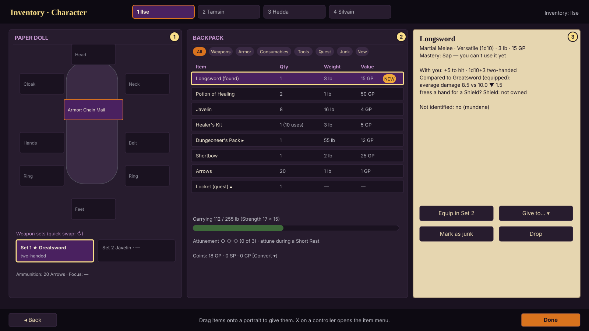
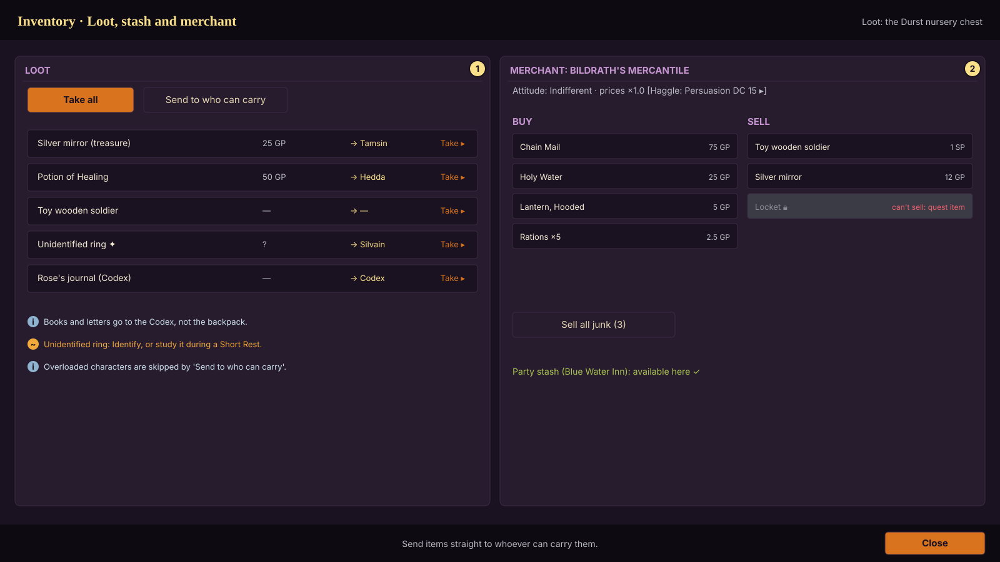

# Inventory (core flow 3 of 4)

Status: **approved by the owner 2026-10-06 ("Looks good")** · Owner role: Character and Party UX · Plan §5.6 "Inventory"
Engine: `Character.inventory / equip / unequip / add_item / carried_weight / carrying_capacity / attacks()`
(Phase 1), `Gear` helpers, item data in `data/items` (183 items). Paper doll slots beyond armor and hands, the
stash, attunement and merchants are Phase 3 and 4 engine work; this spec fixes their screens now.

## What this screen must do

- One inventory per character, plus a party stash. Things go into the stash from anywhere (the item card's Send to
  the stash, the loot window's Stash and All to the stash) and come out only at a safe place: an inn, a home,
  Argynvostholt once reclaimed (owner, 2026-10-07). An item keeps its own state there (charges, identified, a junk
  mark). Currency in cp, sp, ep, gp, pp with conversion.
- Show what every item does *for this character*, compare it with what's equipped, and never let carrying,
  attunement or quest items surprise the player.
- Fast with mouse, keyboard and controller, and smooth with 300+ items (plan's performance budget).

## Character inventory (`inv_01_character`)

- **Paper doll**: head, cloak, neck, armor, hands, belt, two rings, feet; **weapon sets** (main hand + off hand,
  two sets with a quick swap ↻); ammunition and spellcasting focus slots. Equipping armor shows the new AC on the
  slot; armor without training warns before equipping (Disadvantage on Str/Dex rolls, no spellcasting).
- **Backpack**: filters (All, Weapons, Armor, Consumables, Magic, Gear), the New and Junk marks as toggles with their
  counts, sort by name, weight, value or newest, and a search box (every word must appear in the item's name, kind
  or rarity); columns Item / Qty / Weight / Value; packs open as containers (▸). Quest items (and the three
  treasures) show Quest and can't be sold, stashed, dropped or marked as junk. **New** is what arrived since the
  character's page was last opened (finds, purchases, gifts; never starting gear). **Junk** is the player's mark,
  kept when the item changes hands; the Junk view totals its weight and value.
- **Carrying**: carried / capacity with the breakdown (Strength × 15, × size; Powerful Build counts one size larger)
  and the optional DMG encumbrance thresholds if the owner turns them on.
- **Attunement**: three slots; attuning and ending an attunement are instant, from the item's row (owner house rule,
  2026-10-07: no Short Rest needed; docs/rules/deviations.md).
- **Item card** (focus any item): all properties, mastery (and whether the character can use it), what it does for
  this character ("+5 to hit, 1d10+3 two-handed"), a comparison with the equipped item (average damage, AC, weight)
  with ▲/▼ and words, unidentified/cursed state, charges, and actions: Equip in Set 1/2, Give to…, Mark as junk,
  Drop, Use (consumables: a Potion of Healing is a Bonus Action in combat), Split stack.

## Loot, stash and merchant (`inv_02_loot_and_merchant`)

- **Loot window**: Take all, Take one, Take gold (the coins alone, into the party purse), or **Send to who can carry** (skips overloaded characters and says so).
  Books, letters and notes go to the **Codex**, not the backpack. Unidentified items say how to identify them
  (Identify, or study during a Short Rest per 2024 rules).
- **Party transfer**: drag an item onto another portrait (or "Give to…"); the receiving character's capacity is
  checked first.
- **Merchant**: Buy and Sell columns; prices change with the NPC's attitude (Hostile/Indifferent/Friendly, 2024
  Influence) and an optional Persuasion haggle that rolls in the open; "Sell all junk" sells everything the party
  marked as junk that this merchant buys, from every pack at once (equipped things stay); quest items can't be sold.
- **Stash** shows under the backpack everywhere; its Take buttons work only at safe places.

## Combat hooks (Phase 2)

Quick slots for consumables, tracked light durations (torches 1 hour, lamps 6 hours per flask), ammunition
recovery after combat (half the spent pieces), and the wizard's spellbook as a real item (copying a spell costs
50 GP and 2 hours per level).

## States

| State | What the player sees |
|---|---|
| Empty backpack | "Nothing here yet" with the filters still visible |
| Overloaded | capacity bar red with the number over; Speed effect explained; "Send to…" suggestions |
| Item can't be used well | ~ on the card: "Not proficient: no Proficiency Bonus on attacks" |
| Quest item | 🔒 and "Can't sell or drop: needed for <quest>" |
| Unidentified | ✦ and how to identify; properties hidden |
| Attunement full | the fourth item says which one to end first |
| Controller | D-pad moves in the grid, A equips/uses, X opens the item menu, Y explains, LB/RB filters, LT/RT character |

## Acceptance

- Engine (Phase 1, passing): starting equipment for every class and background, auto-equip, AC from armor and
  shields, Strength penalty, Stealth Disadvantage, weapon profiles, carrying capacity by size.
- Phase 3: 300-item inventory scrolls and filters without a frame over 16 ms; drag between characters; loot to
  whoever can carry; quest items locked.
