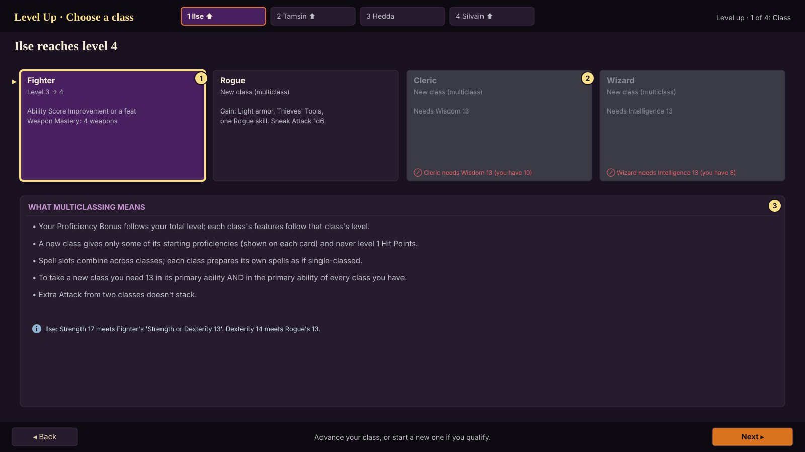
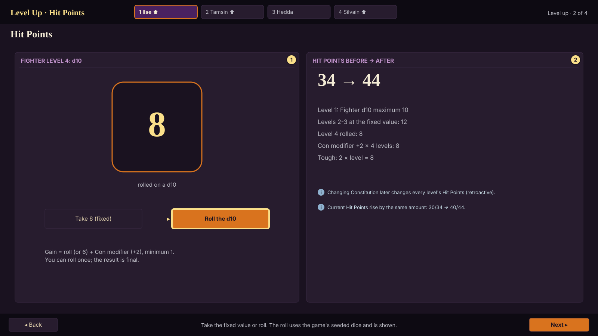
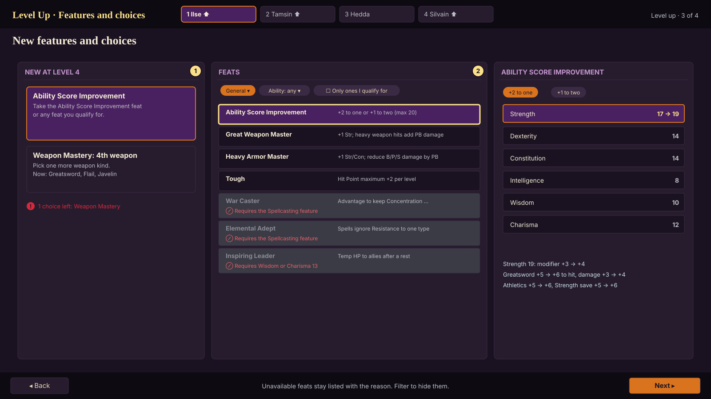
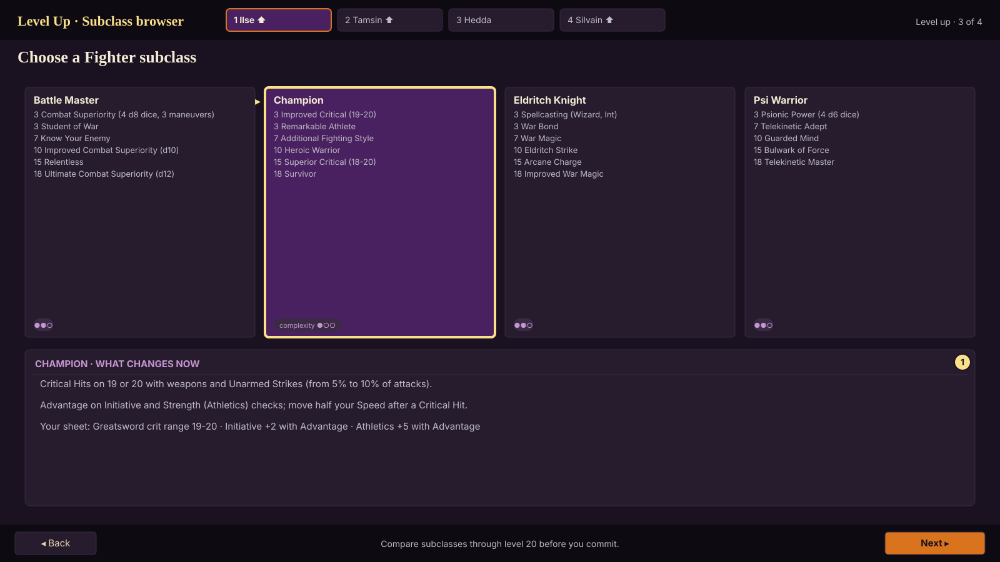
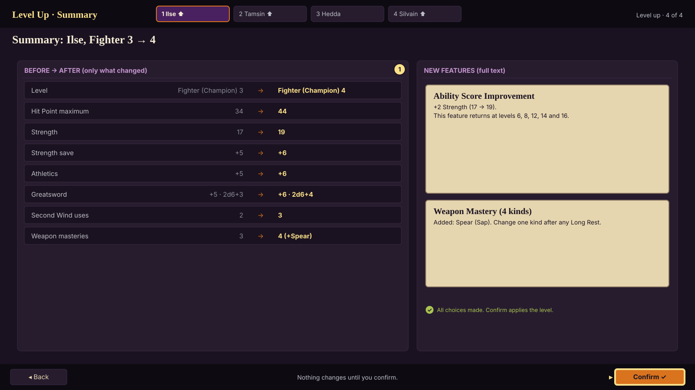

# Level up (core flow 2 of 4)

Status: **approved by the owner 2026-10-06 ("Looks good")** · Owner role: Character and Party UX · Plan §5.1, §5.6
Engine: `LevelUpController` (rules/progression/level_up_controller.gd), `ChoiceOptions`.

## What this screen must do

- Let the player level any party member any time out of combat, with milestone leveling by default (XP as an
  option): a ⬆ badge appears on the portrait when a level is available.
- Make every 2024 rule visible: multiclass prerequisites, Hit Points by roll or fixed value, every new feature with
  full text, every choice the level grants, and a before/after summary. Nothing changes until Confirm.

## Flow

Four screens with the same frame as character creation (party strip with ⬆ badges, Back / Next, hint line).
Steps without anything to do are skipped automatically (a level with no choices goes Class → Hit Points → Summary).

### 1. Class (`lu_01_class`)

Cards for every class from `available_classes()`: the current class ("Level 3 → 4" and what it brings) and every
other class as a multiclass option. Classes the character can't take stay visible with the reason, which names
every unmet requirement, e.g. "Wizard needs Intelligence 13 (you have 8)" or "your Fighter levels need Strength or
Dexterity 13". Each multiclass card lists the limited proficiencies it grants. A panel explains what multiclassing
changes (shared Proficiency Bonus, partial proficiencies, no level 1 Hit Points, combined spell slots, Extra Attack
not stacking).

### 2. Hit Points (`lu_02_hit_points`)

"Take 6 (fixed)" or "Roll the d10" (`take_fixed_hit_points()` / `roll_hit_points(dice)`), with the roll animated
and final. The panel shows the maximum before → after with its breakdown, including retroactive changes (Tough, a
Constitution increase) and how current Hit Points rise.

### 3. Features and choices (`lu_03_features_and_choices`, `lu_03b_subclass`)

- **New features** from `new_features()` as cards with full text.
- **Choices** from `level_choices()`: every new choice and every choice whose count grew (a new cantrip, more
  prepared spells, two spellbook spells, the fourth Weapon Mastery). Same widgets as character creation, picked by
  `kind`.
- **Subclass browser** at the subclass level: the four subclasses side by side with features through level 20
  and what changes on the sheet right now.
- **Feat browser** for Ability Score Improvement levels: filters (category, ability, "only ones I qualify for", off
  by default so the reasons stay visible), each unavailable feat with its reason ("Requires the Spellcasting
  feature", "Requires Wisdom or Charisma 13"), and the feat's own choices inline (ASI: +2 to one or +1 to two, with
  current → new scores and the knock-on numbers).
- **Spells**: Wizards add two spells to the spellbook (levels they can cast) and update prepared spells; Clerics
  see the new prepared count; cantrip swaps where the class allows.
- A counter shows the choices left; Next is allowed, Confirm isn't until all are made.

### 4. Summary (`lu_04_summary`)

The rows from `changes()` (only what changed: level, Hit Point maximum, Proficiency Bonus, AC, scores, saves, slots,
spell DCs, class resources, attacks, Hit Point Dice) as before → after, and the new features with full text.
**Confirm** applies it (`confirm()`); Back returns to any step.

## Rules the screens must get right (all in the engine, tested in Phase 1)

- Multiclass spell slots (full + half rounded up + third rounded down), each class preparing as if single-classed.
- A third caster alone uses its own table (Eldritch Knight 4: three level 1 slots).
- The ability score cap of 20 (epic boons 30), retroactive Hit Points for Constitution and Tough, minimum 1 Hit Point
  per level, no level 1 Hit Points for a multiclass level.
- Respec (plan §5.6) is a separate flow at Madam Eva's; the owner can switch it off.

## States

| State | What the player sees |
|---|---|
| Level available | ⬆ on the portrait in the party strip, the HUD and the party screen |
| No class chosen | Hit Points and later steps locked with "Choose a class first" |
| Class can't be taken | card greyed with every unmet requirement |
| Choices incomplete | counter in red ("1 choice left: Weapon Mastery"); Confirm disabled |
| Illegal pick | reason on the pick; listed on the summary |
| Warning | ~ text (e.g. a spell already granted elsewhere); never blocks |
| Leaving mid-flow | "Leave level up? Nothing has changed yet." |
| Confirmed | the badge clears; a toast lists the new features |

## Engine contract (implemented in Phase 1)

`LevelUpController.new(character)` · `can_level_up() / available_classes() / multiclass_problem(id) / choose_class(id)` ·
`hit_point_options() / roll_hit_points(dice) / take_fixed_hit_points()` ·
`new_features() / level_choices() / pending_choices() / choose(key, picks)` ·
`preview() -> Character / changes() / errors() / warnings() / confirm()`.

## Acceptance

- Headless (passing): the reference party levels 1 to 5 and matches hand-worked sheets; every subclass levels to 5;
  multiclass prerequisites and slot math; Tough and Constitution retroactive Hit Points; blocked confirm changes
  nothing.
- Phase 3 UI test: level each reference character through the screens with keyboard only and controller only.
