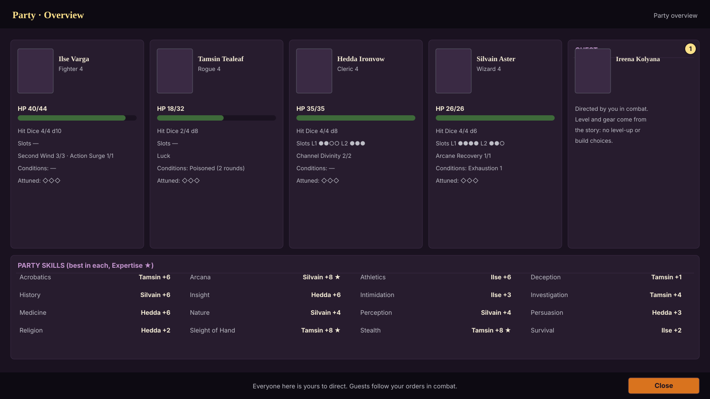
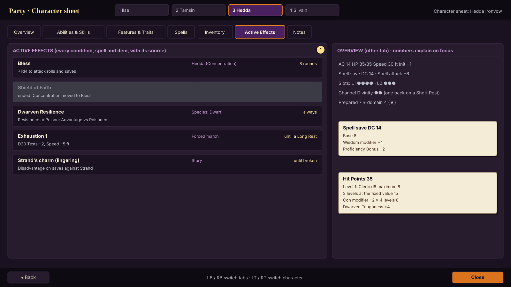
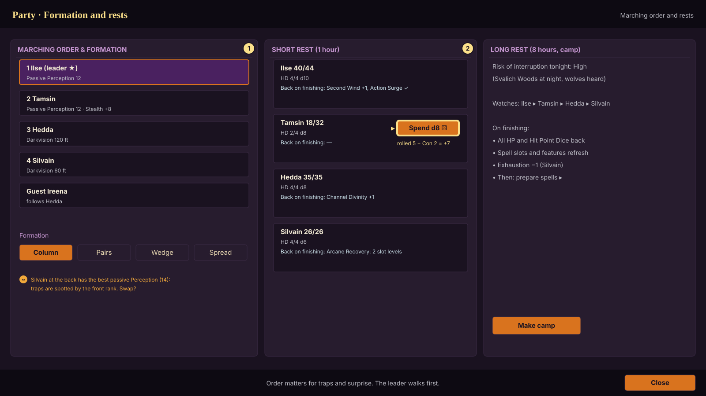
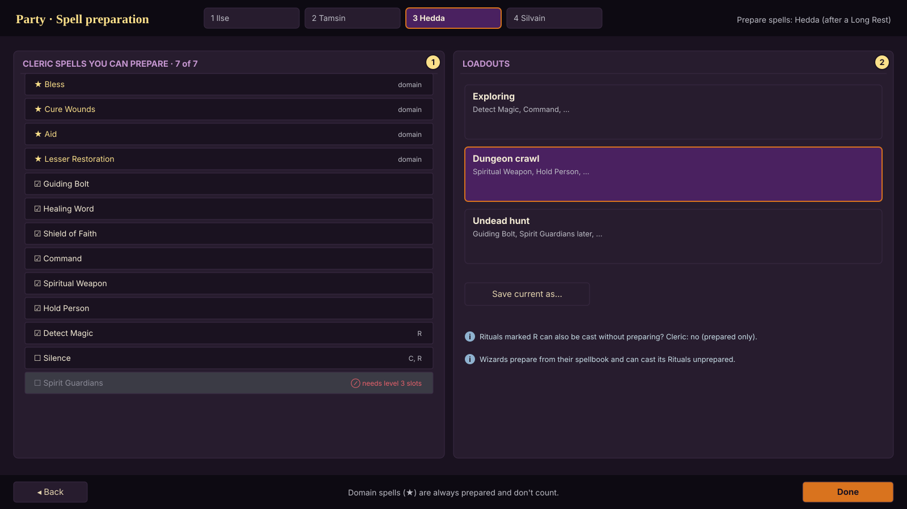

# Party management (core flow 4 of 4)

Status: **approved by the owner 2026-10-06 ("Looks good")** · Owner role: Character and Party UX · Plan §5.2, §5.6 "Party management"
Engine: `Character` sheet values and breakdowns, `Creature.effects / active_conditions / resources`,
`Character.spend_hit_die / finish_short_rest / finish_long_rest / known_spells / spellcasting`, `PartyCoverage`.

## What this screen must do

- Show the whole party at a glance, and every detail of one character, with every number explained.
- Make the player the director of everyone: the four party members and any story guest. Guests are directed in
  combat like the party but their level and gear come from the story.
- Run rests and spell preparation, and track the lingering things Barovia does to people.

## Party overview (`pm_01_overview`)

Four columns plus the guest slot: portrait, class and level, Hit Points bar (Bloodied called out in words), Hit
Point Dice, spell slots, class resources (Second Wind, Channel Divinity ...), conditions with remaining time,
exhaustion, attunements, and the ⬆ level-up badge. Below: the **party skill table** (best character per skill,
Expertise starred), from `PartyCoverage`.

## Character sheet (`pm_02_sheet`)

Tabs: Overview · Abilities & Skills · Features & Traits · Spells · Inventory · Active Effects · Notes.
- **Overview**: AC, HP, Speed, Initiative, Proficiency Bonus, spell DC and attack, slots, resources; each opens its
  breakdown (`Breakdown.describe()`).
- **Features & Traits**: every feature with its source (class level, subclass, species, background, feat) and full
  text; `implemented: text` features are marked "rules text only for now" until their system exists.
- **Active Effects**: every condition, spell and item effect with its source, what it does and its remaining
  duration (`Effect.describe_duration()`), including ended Concentration effects greyed for a turn so the player
  sees what just dropped.
- **Lingering effects** specific to Barovia (Amber Temple dark gifts, lycanthropy, Strahd's charm, curses, the mists'
  madness) live here too, tagged "Story".

## Formation and rests (`pm_03_formation_and_rests`)

- **Marching order**: drag to reorder; the leader (★) walks first and can be switched any time (Tab or 1-4 in
  exploration). Each row shows what matters for order: passive Perception, Stealth, darkvision. Formations: Column,
  Pairs, Wedge, Spread. A tip appears when the best spotter is at the back.
- **Short Rest**: per character, spend Hit Point Dice one at a time with on-screen dice (roll + Con, minimum 1:
  `spend_hit_die`), and a list of what comes back on finishing (Second Wind +1, Channel Divinity +1, Arcane
  Recovery's slot levels to choose).
- **Long Rest**: camp scene with the interruption risk for the region and time, watch order, and what finishing
  restores (all HP and Hit Point Dice, slots, features, Exhaustion −1), then spell preparation.

## Spell preparation (`pm_04_spell_preparation`)

Per character: "7 of 7" counter, always-prepared domain spells marked ★ and not counted, Ritual and Concentration
tags, spells above the character's slots greyed with the reason, and saved **loadouts** (Exploring, Dungeon crawl,
Undead hunt). Wizards prepare from their spellbook; the screen notes that they can cast spellbook Rituals unprepared.

## States

| State | What the player sees |
|---|---|
| Character at 0 HP | portrait greyed, "Unconscious · Death saves ✓✓ ✗" |
| Dead | portrait faded, "Dead" and the ways back (Revivify within 1 minute ...) |
| Guest present | fifth column "Guest: directed by you in combat; level and gear come from the story" |
| Rest unavailable | "Can't rest: enemies nearby" or "needs at least 1 Hit Point" |
| Interrupted rest | what was gained (a Short Rest's benefits after 1 hour of a Long Rest) |
| Controller | LB/RB tabs, LT/RT character, A on a number opens its breakdown |

## Acceptance

- Engine (Phase 1, passing): breakdowns for every sheet number, effects with durations and Concentration, conditions,
  death saves, Hit Point Dice, rests restoring resources and slots, known spells with their sources.
- Phase 3: rest screens drive the engine end to end; a UX review at the milestone exit.
